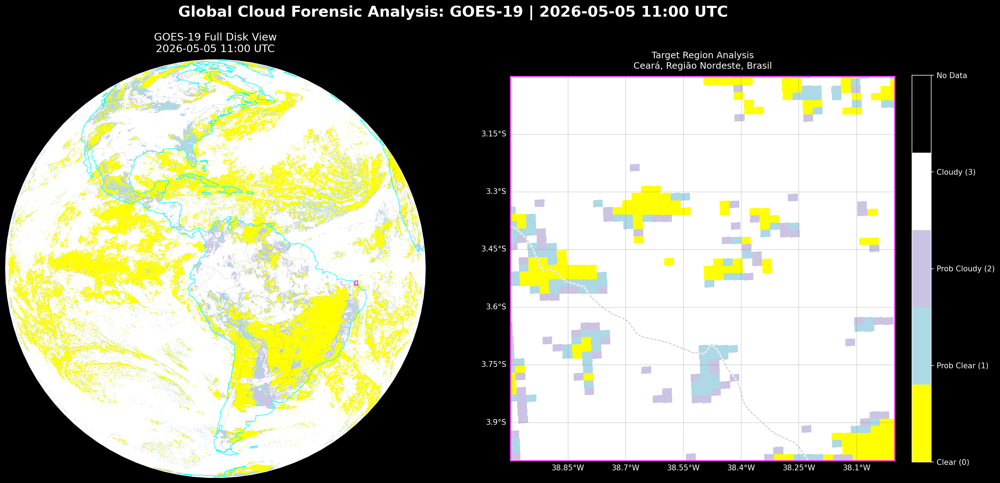

# weather_detection.py



Multi-satellite cloud forensic analysis tool. Queries geostationary cloud-mask products from up to 8 satellites simultaneously, extracts cloud/clear fractions for a user-defined region, ranks results by observation quality, and exports a GeoJSON summary.

---

## Satellites Supported

| Satellite   | Source  | Product        | Coverage (lon)   |
|-------------|---------|----------------|------------------|
| GOES-16     | AWS     | ABI-L2-ACMF    | −110° to −25°    |
| GOES-18     | AWS     | ABI-L2-ACMF    | −180° to −100°   |
| GOES-19     | AWS     | ABI-L2-ACMF    | −110° to −25°    |
| Himawari-8  | AWS     | AHI-L2-FLDK    | 85° to 180°      |
| Himawari-9  | AWS     | AHI-L2-FLDK    | 85° to 180°      |
| MTG-0       | EUMDAC  | FCI-2-CLM      | −45° to 30°      |
| MSG-2       | EUMDAC  | MSGCLMK (GRIB) | 20° to 95°       |
| MSG-3       | EUMDAC  | MSGCLMK (GRIB) | −75° to 75°      |

Only satellites whose longitude coverage overlaps the target region are processed.

---

## Installation

```bash
pip install xarray matplotlib cartopy numpy boto3 pytz botocore scipy \
            geopy pyproj eumdac shapely cfgrib h5netcdf
```

**EUMDAC credentials** (required only for MSG-2, MSG-3, MTG-0):  
Create `~/.eumdac/credentials` containing your EUMDAC key and secret on one line:

```
YOUR_KEY,YOUR_SECRET
```

---

## Usage

### Axis-aligned bounding box

```bash
python weather_detection.py \
    --date 2026-05-05 \
    --time_utc 11:00 \
    --north 30 --south 29 --west -83 --east -82
```

### Tilted / arbitrary quadrilateral

Pass 4 corner points in any winding order — they are automatically reordered via convex hull:

```bash
python weather_detection.py \
    --date 2026-05-05 \
    --time_utc 11:00 \
    --corners "30.0,-83.0 30.0,-82.0 29.5,-81.8 29.0,-82.5"
```

### With visualisation plots

Add `--plots` to generate PNG images (full-disk context + region zoom):

```bash
python weather_detection.py \
    --date 2026-05-05 \
    --time_utc 11:00 \
    --north 30 --south 29 --west -83 --east -82 \
    --plots
```

---

## Arguments

| Argument      | Type   | Required | Description                                       |
|---------------|--------|----------|---------------------------------------------------|
| `--date`      | str    | Yes      | Analysis date (`YYYY-MM-DD`)                      |
| `--time_utc`  | str    | Yes      | Analysis time in UTC (`HH:MM`)                    |
| `--north`     | float  | *        | Northern latitude bound (degrees)                 |
| `--south`     | float  | *        | Southern latitude bound (degrees)                 |
| `--east`      | float  | *        | Eastern longitude bound (degrees, negative = W)   |
| `--west`      | float  | *        | Western longitude bound (degrees, negative = W)   |
| `--corners`   | str    | *        | 4 corners as `"lat,lon lat,lon lat,lon lat,lon"`  |
| `--plots`     | flag   | No       | Generate PNG visualisations                       |

\* Provide either `--corners` **or** all four of `--north/--south/--east/--west`.

---

## Outputs

All outputs are written to `Clouds_coverage_c/`.

| File | Description |
|------|-------------|
| `run_YYYYMMDD_HHMM.log` | Full console log (mirrors stdout) |
| `analysis_YYYYMMDD_HHMM.geojson` | GeoJSON FeatureCollection with cloud statistics per satellite |
| `{SAT}_YYYYMMDD_HHMM_forensic.png` | *(--plots)* Full-disk + region zoom for GOES / Himawari / MTG |
| `{SAT}_YYYYMMDD_HHMM_dual_analysis.png` | *(--plots)* Full-disk + region zoom for MSG-2 / MSG-3 |

Downloaded NetCDF / GRIB files are cached in `Downloads/` and reused on repeated runs.

### GeoJSON schema

```json
{
  "type": "FeatureCollection",
  "features": [
    {
      "type": "Feature",
      "geometry": { "type": "Polygon", "coordinates": [...] },
      "properties": {
        "feature_type": "Analysis Region",
        "analysis_time_utc": "2026-05-05T11:00:00+00:00",
        "satellites": [
          {
            "satellite": "GOES-19",
            "priority_order": 1,
            "cloud_pct": 72.3,
            "clear_pct": 27.1,
            "effective_pixels": 2065.0,
            "nodata_pct": 0.6,
            "dqf_masked_pct": 0.0,
            "dqf_note": "All pixels DQF-good (0 or 1)",
            "vza_deg": 18.4,
            "vza_reliable": true,
            "vza_threshold_deg": 70.0,
            "status": "Reliable"
          }
        ]
      }
    },
    {
      "type": "Feature",
      "geometry": { "type": "Point", "coordinates": [-82.5, 29.5] },
      "properties": { "feature_type": "Region Centroid", "analysis_time_utc": "..." }
    }
  ]
}
```

---

## How It Works

### 1. Coverage check
Each satellite's longitude range is compared against the target bounding box. Only overlapping satellites are downloaded and processed.

### 2. Data download
- **NOAA satellites** (GOES, Himawari): downloaded anonymously from public AWS S3 buckets. The file with the scan start time closest to `--time_utc` is selected.
- **EUMETSAT satellites** (MTG-0, MSG-2, MSG-3): retrieved via the EUMDAC Python API with a ±45-minute search window around `--time_utc`.

### 3. Coordinate projection
- **GOES / MTG**: native geostationary projection (`x`/`y` scan angles) is inverted to lat/lon using `pyproj`.
- **SEVIRI (MSG-2 / MSG-3)**: coordinates are reconstructed analytically from GRIB header constants (WMO GDT 3.90 formula); no external coordinate variable is needed.
- **Himawari**: lat/lon arrays are read directly from the NetCDF file.

### 4. Pixel weighting
Edge pixels that partially overlap the target polygon receive a fractional weight (0–1) proportional to the intersection area of the pixel footprint and the polygon. Interior pixels receive weight 1.0. All statistics are computed on these effective pixel counts.

### 5. DQF filtering
For NOAA satellites, pixels with Data Quality Flag ≥ 2 (unusable) are set to no-data before statistics are computed. The percentage excluded is reported separately.

### 6. Cloud fraction
- **NOAA ACM / Himawari CMSK**: four classes (0 = Clear, 1 = Probably Clear, 2 = Probably Cloudy, 3 = Cloudy). Clear and cloud fractions are probability-weighted:
  - Clear weight: 1.0 / 0.67 / 0.34 / 0.0
  - Cloud weight: 0.0 / 0.33 / 0.66 / 1.0
- **EUMETSAT (SEVIRI / FCI)**: three classes (0 = Clear water, 1 = Clear land, 2 = Cloud, 3 = No data). Fractions are direct counts; values 0 and 1 both contribute to clear%.

### 7. Priority ranking
When multiple satellites cover the same region, results are ranked:
1. Lower no-data % wins (data completeness first)
2. Lower Viewing Zenith Angle (VZA) wins among equal no-data results (closer to nadir = less distortion)

Results with VZA > 70° or no-data > 30% are flagged as unreliable.

---

## Notes

- **No-data > 50%** triggers a warning; the result may correspond to night-time, edge-of-disk, or a processing gap.
- **VZA > 70°** triggers an unreliable flag due to large pixel footprints and parallax displacement at steep off-nadir angles.
- SEVIRI GRIB files use a static land-sea mask; coastal pixels may show mixed Clear Water / Clear Land values. Both are counted as clear.
- Downloaded files are not deleted between runs. Remove `Downloads/` manually to force a fresh download.
- The log file mirrors all stdout output. On Windows, ensure the terminal and log file use UTF-8 encoding (`chcp 65001` or set `PYTHONUTF8=1`) to avoid codec errors.
